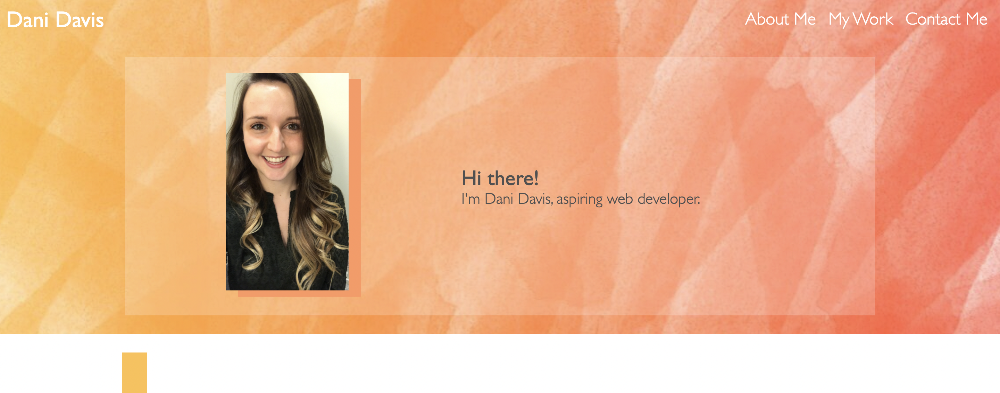
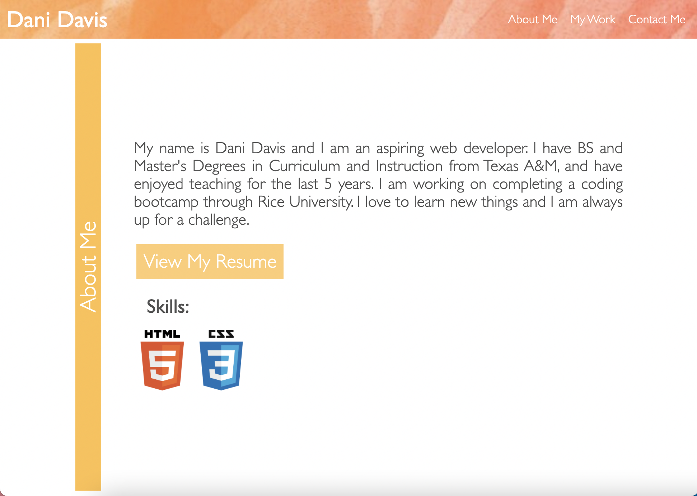
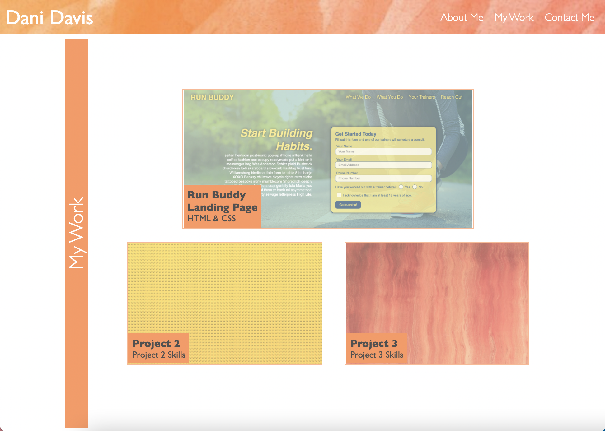
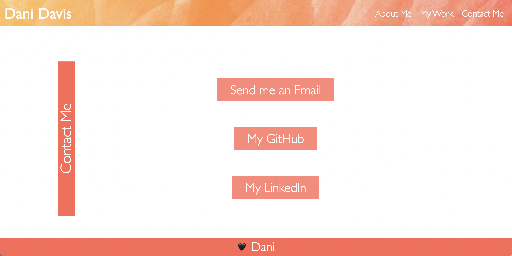

# Dani Davis' Portfolio

## Description

I am an aspiring web developer, working through Rice University's Coding Bootcamp. 

This site is my professional portfolio, which introduces me and provides information about me, my work, and how to contact me. All of this is contained in an attractive, streamlined, mobile-responsive landing page.

[Portfolio Website](https://danidelia253.github.io/portfolio/)

[Project Repository](https://github.com/DaniDelia253/portfolio)

## Table of Contents 

* [Usage](#usage)
* [Credits](#credits)

## Usage

Use the links at the top of the page to navagate the landing page:

* **Dani Davis** link loads the main landing page
    

* **About Me** link jumps to the section of the page that provides information about me
    

* **My Work** link jumps to the section of the page that showcases my projects
    

* **Contact Me** link jumps to the section of the page that provides my contact information
    

## Credits

Mock Up of example portfolio page provided by Trinity Education Sercice © 2021 Trilogy Education Services, LLC, a 2U, Inc. brand. Confidential and Proprietary. All Rights Reserved.

[Project Repository](https://github.com/DaniDelia253/portfolio)

---

